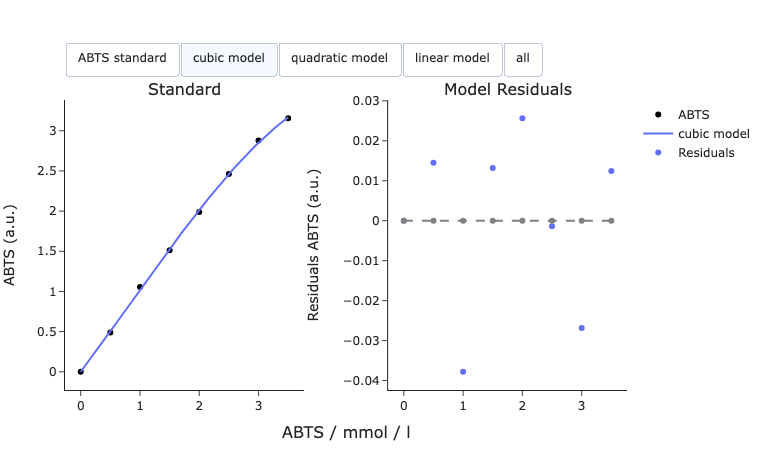

# CaliPytion - Tool to create, apply, and document calibration models for concentration calculation

[](https://fairchemistry.github.io/CaliPytion/)
[](https://github.com/FAIRChemistry/CaliPytion/actions/workflows/tests.yaml)
[](https://badge.fury.io/py/CaliPytion)

## Overview


CaliPytion is a Python package for the creation, application, and documentation of calibration models for concentration calculations from a measured standard. This package allows for comparing different calibration models and selecting the best one based on various statistical metrics like R<sup>2</sup>, AIC, or RMSD. The selected model can then calculate the concentration of unknown samples from their measured signals. Furthermore, the calibration standard containing the calibration model and information on the used substance and measurement conditions can be exported in JSON and [AnIML](https://www.animl.org/) format for reuse and documentation.

## Key Functionalities

- 📈 __Model Fitting and Visualization__:  
Automatically fits different polynomial models to the data and provides interactive plots for visually comparing these models.
- 🎯 __Model Selection__:  
After fitting, a model overview is generated, allowing the user to select the best model based on the desired metric.
- 🚷 __Avoid Extrapolation__:  
It prevents the use of models outside the calibrated concentration range. However, by user choice, the model can be extrapolated to calculate concentrations outside the calibration range.  
- 🧪 __Compatible with EnzymeML Documents__:  
CaliPytion can be used to convert the measured signals of an EnzymeML document into concentrations.  
- 📂 __FAIR Data__:  
Calibration models are stored together with the standard data. Constituting a complete record of the calibration process, this data can be saved as a JSON or AnIML file. 

## Installation

CaliPytion can be installed via pip:

```bash
pip install calipytion
```

or directly from the source code:

```bash
pip install git+https://github.com/FAIRChemistry/CaliPytion.git
```

## Minimal Example

```python 
from calipytion import Calibrator

# standard data
concentrations = [0, 0.5, 1, 1.5, 2, 2.5, 3, 3.5]
absorption = [0, 0.489, 1.056, 1.514, 1.988, 2.462, 2.878, 3.156]

# unknown data
unknowns = [0.3, 1, 1.345]

# initialize the calibrator
calibrator = Calibrator(
    molecule_id="s0",
    molecule_name="ABTS",
    conc_unit="mmol / l",
    concentrations=concentrations,
    signals=absorption,
)

# fit and visualize model
calibrator.fit_models()
calibrator.visualize()

# choose cubic model
cubic_model = calibrator.get_model("cubic")

# calculate concentrations
print(calibrator.calculate_concentrations(cubic_model, unknowns))
# -> [0.30018883573518623, 0.9823197194444907, 1.3193203297973393]
```

<p style="text-align: center;">Model Overview</p>

| **Model Name** | **AIC** | **R squared** | **RMSD**  | **Equation**                      | **Relative Parameter Standard Errors**  |
|----------------|---------|---------------|-----------|-----------------------------------|------------------------------------------|
| cubic          | -56     | 0.9996        | 0.0205    | a * s0 + b * s0\*\*2 + c * s0\*\*3 | a: 4.6%, b: 67.4%, c: 33.6%              |
| quadratic      | -49     | 0.9991        | 0.0318    | a * s0 + b * s0\*\*2 + c          | a: 4.0%, b: 20.0%, c: 115.2%             |
| linear         | -37     | 0.9929        | 0.0891    | a * s0                            | a: 1.7%                                  |




